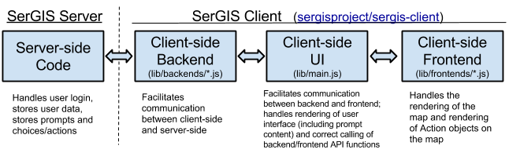
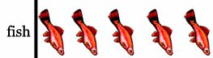

# SerGIS JSON Format Documentation

SerGIS has a special JSON format that is used to store its data. This JSON content is not usually directly available on the client-side, but rather it is used on the server-side so the server can push the data to the client as needed (or directly used by the backend if no server-side system is used).

## SerGIS JSON Object Reference

These objects are referenced below in the JSON spec.

### Action Object

A SerGIS JSON Action Object is an object representing either a "Map Action" (an action to do on the map) or a "Gameplay Action" (an action that affects the gameplay).

| Property | Type   | Value
| -------- | -----  | -----
| `name`   | string | The name of the action to perform. Must be either a Gameplay Action (listed below) or a Map Action.
| `frontend` | string | If this is a Map Action, this should be the [frontend][frontends] that the Map Action name is in. (MUST be provided if `name` refers to a Map Action; MUST NOT be provided if `name` refers to a Gameplay Action)
| `data`   | array  | Any data to pass as parameters to the action function. If the action function does not take any parameters, you can leave this out.

**Gameplay Actions:** These actions do not affect the map, but rather affect the game sequence. The `name`s of these actions are:

| Action Name | Data Array Description | Description
| ----------- | ---------------------- | -----------
| `explain` | [[`Content`][contentobject], [`Content`][contentobject], ...] | Show an explanation for why the choice that the user chose was correct or incorrect. The data is an array of [Content objects][contentobject] holding the explanation to display; in most cases, it will be an array of only one [Content object][contentobject]. If this is provided before any Map Actions, it will be shown to the user before those Map Actions are rendered.
| *`endGame`* (DEPRECATED*) | [] | End the game immediately. **Cannot be combined with any other actions!**
| *`goto`* (DEPRECATED*) | [`number`] | Go to a specific prompt. **If combined with Map Actions, it must be the *last* action!**

\* The `endGame` and `goto` actions are deprecated, and should not be used. Instead, authors should use the `nextPrompt` property in the `actionList` (see near bottom of this page). These deprecated actions are not implemented by the SerGIS client, but rather by the SerGIS backend (see [Action Preprocessing][action-preprocessing] for more).

**Map Actions:**

The names of map actions vary by [frontend][frontends]. Therefore, in order to support multiple frontends, you must provide a separate Action object for each frontend.

For example, the following could be a list of actions. Note how Gameplay Actions are only specified once, but Map Actions are each specified multiple times, once for each supported frontend.

    [
        {
            "name": "explain",
            "data": [
                {"type": "text", "value": "Choice Explanation Here"}
            ]
        },
        {
            "frontend": "arcgis",
            "name": "buffer",
            "data": [120]
        },
        {
            "frontend": "googlemaps",
            "name": "buffer",
            "data": [120]
        }
    ]

### Collectible Object

A SerGIS JSON Collectible Object represents a visual way to show to the user certain collectibles. These are shown in a special status bar in the interface. Each collectible uses a state variable behind the scenes to store and manipulate how many of the collectible there are. (For more on creating and modifying state variables, see [State Variables][state-variables].)

There are 2 ways of showing collectibles:

1. **Numeric representation:** This is simply a representation that shows the user how many of a collectible they have. **Example:** "Cows: 15"
2. **Picture representation:** This represents the value of the variable by showing an amount of pictures relative to how much of the collectible the user has. **Example:** 
3. **Bar representation:** This represents the value in a "progress bar" format, or a bar that is filled relatively to how much of the collectible the user has. **Example:** 

| Property | Type | Value
| -------- | ---- | -----
| `type` | string | One of the following: "numeric", "picture", "bar"
| `variable` | string | The name of the [State Variable][state-variables] to use as the value for the Collectible.
| `label` | string | A label for the collectible.
| `image` (optional) | string | **If type is "picture":** The URL of the image to use as the pictures.
| `interval` (optional) | number | **If type is "picture":** This is the amount that each picture is worth (for example, if this is 5 and the value of the variable is 15, then 3 pictures will be shown). Default: 1
| `total` (optional) | number | **If type is "bar":** This is the largest value that the variable could be (so, if the value of the variable is equal to this value, then the entire bar will be full). Default: 100

### Condition Object

A SerGIS JSON Condition Object is an object representing a condition that can be resolved to `true` or `false`. It is used in the conditional version of `nextPrompt` (see near the bottom of this page).

| Property | Type   | Value
| -------- | ----   | -----
| `type`   | string | One of the following: `and`, `or`, `varEmpty`, `varEqualTo`, `varGreaterThan`, `varLessThan`, `true`, `false`
| `data`   | (varies) | Data that goes along with the condition type.

The following conditions are supported:

| Type | Resolves to true if... | Data Type | Data Description
| ---- | ---------------------- | --------- | ----------------
| `and` | All of its children resolve to true. | array&lt;[Condition][conditionobject]&gt; | One or more other Conditions.
| `or` | At least one of its children resolves to true. | array&lt;[Condition][conditionobject]&gt; | One or more other Conditions.
| `varEmpty` | The specified variable is unset or equal to `0`. | string | The name of the variable to check.
| `varEqualTo` | The specified variable is equal to the specified value. | array `[string, number]` | The name of the variable to check and the value to compare it to.
| `varGreaterThan` | The specified variable is greater than the specified value. | array `[string, number]` | The name of the variable to check and the value to compare it to.
| `varLessThan` | The specified variable is less than the specified value. | array `[string, number]` | The name of the variable to check and the value to compare it to.
| `true` | Always resolves to true. | (none) | (data not required)
| `false` | Never resolves to true. | (none) | (data not required)

### Content Object

A SerGIS JSON Content Object is an object representing some sort of content that is part of a prompt or choice.

It must have a `type` property that identifies what type of content it is. The value of the `type` property determines which other properties are present.

The main value for the type is stored in `value` (which is required). CSS attributes can be specified by passing them in a string stored in `style` (this should match the formatting of the HTML style attribute). Some types have other possible properties too, all of which are optional (their default values are shown).

 - **Text Type:** `{"type": "text", "value": "plain text here", "centered": false}`
 - **HTML Type:** `{"type": "html", "value": "
HTML content here
"}`
 - **Image Type:** `{"type": "image", "value": "URL of image", "centered": true}`
 - **YouTube Type:** `{"type": "youtube", "value": "youtube-video-id-here", "width": 400, "height": 300, "playerVars": {"autohide": 1}, "centered": true}`

### Map Object

A SerGIS JSON Map Object is an object representing a map state, including location (i.e. latitude/longitude) and zoom.

| Property | Type   | Value
| -------- | ------ | -----
| `latitude` | number | The latitude position (negative values are north, positive are south).
| `longitude` | number | The longitude position (negative values are west, positive are east).
| `zoom` | number | The zoom level of the map.
| `frontendInfo` | object | An object with frontend-specific map information, where each key is the name of a [frontends][frontends] (corresponding to the frontend's name property) and the value is an object with specific information for that frontend. To find out the values for each frontend, look at the top of the frontend's file for a comment block starting with "SerGIS JSON Map Object - frontendInfo for [frontend name]".

### Prompt Object

A SerGIS JSON Prompt Object is an object representing either a question for the user or information to show the user.

| Property  | Type   | Value
| --------  | ----   | -----
| `title`   | string | A text-only title for the prompt (usually just the general topic of the question or information).
| `map` (optional) | [Map][mapobject] | A Map object representing the state of the map for this prompt. If any of `latitude`, `longitude`, or `zoom` are not provided in this object, or if `map` is not provided, then the previous values are used. **MUST be provided for the first prompt**, and **should be provided for all prompts if jumping is allowed** (see [Backends](#backends) below).
| `contents` | array&lt;[Content][contentobject]&gt; | The content of the prompt. Each array item must be a Content object. The array must have at least one item.
| `choices` (optional) | array&lt;[Content][contentobject]&gt; | A list of the possible choices for the prompt. Each item must be a Content object that represents the choice. (NOTE: Unlike in the `contents` property, only one Content object can be provided for each choice.) If not provided, or if empty, a "Continue" button is shown if it is not the last prompt. (This may be useful if the prompt just provides information instead of asking a question.)
| `randomizeChoices` (optional) | boolean | Whether to randomize the choices for this prompt.
| `buttons` (optional) | object | Frontend-specific toolbar buttons to show/hide/enable/disable. This should be an object whose keys are frontend names and whose values are another object. This object should then have keys matching button IDs and values being another object with `hidden` or `disabled` properties (to change the state of the button with that ID).
| `collectiblesShown` (optional) | array&lt;string&gt; | An array of strings representing IDs of [Collectibles][collectibleobject] to visually show state variables to the user during this prompt. The collectibles are defined in the `collectibles` object in the root of the [SerGIS JSON Game Data][sergis-json-game-data].

Example value for `buttons`:

    "buttons": {
        "arcgis": {
            "measureButton": {
                "hidden": false,
                "disabled": true
            }
        },
        "googlemaps": {
            "measureButton": {
                "hidden": false,
                "disabled": true
            }
        }
    }

## SerGIS JSON Game Data

SerGIS JSON Game Data is a JSON file with a specific structure. The JSON data consists of an object with the following properties:

| Property | Type | Value
| -------- | ---- | -----
| `layout` (optional) | object | Configuration regarding the layout of the game (see below).
| `jumpingBackAllowed` (optional) | boolean | Whether the user is allowed to go back to previously answered prompts, allowing the user to change the values that he or she put. (Provided to the client through the `logIn` and `getUser` functions of the [client backend][backends].) Default: `false`
| `onJumpBack` (optional) | string | Says what should happen regarding prompts (after the one to which the user is jumping back) for which the user already made a choice. One of the following: `"reset"` (disregard all the choices that the user has made on prompts after the one he or she is jumping back to), `"hide"` (remember the user's choices, but don't show any Map Actions on the map), Anything else (e.g., an empty string, or just not providing `onJumpBack`) - remember the user's choices and show the corresponding Map Actions on the map
| `jumpingForwardAllowed` (optional) | boolean | Whether the user is allowed to skip prompts and come back to them later. If this is `true` but `jumpingBackAllowed` is not, then the user will not be able to go back to questions that he or she skips. (Provided to the client through the `logIn` and `getUser` functions of the [client backend][backends].) Default: `false`
| `showActionsInUserOrder` (optional) | boolean | Whether to render the Map Actions in the order that the user went through the prompts (applies if `jumpingForwardAllowed` and/or `jumpingBackAllowed` are true). If this is false, the actions are rendered in the order of the prompts that they come from, regardless of the order in which the user chose them. Should be utilized by the handler for the `getPreviousMapActions` function of the [client backend][backends]. Default: `false`
| `collectibles` (optional) | object&lt;string, [Collectible][collectibleobject]&gt; | Any [Collectibles][collectibleobject] used during the game to show the user the value of a [State Variable][state-variable]. Each key in the object is an ID for the collectible, and the value is the corresponding [Collectible][collectibleobject]. All Collectibles are hidden by default, but individual prompts can show them by setting their `collectiblesShown` object.
| `promptList` | array | An array of objects representing the different prompts and choices (see below).

- The `layout` object has the following properties:

  | Property | Type | Value
  | -------- | ---- | -----
  | `defaultSidebarWidthRatio` | number | A number between 0 and 1 indicating the default % of the horizontal screen real estate that should be taken up by the prompt sidebar. Default: ???
  | `disableSidebarResizing` | boolean | Whether horizontal resizing of the prompt sidebar should be disabled. Default: `false`
  | `disableTranslucentSidebar` | boolean | Whether the translucent prompt sidebar, with the map behind it, should be opaque instead, with the map only extending to its border and not behind it. Default: `false`
  | `showPromptNumber` | boolean | Whether to show "Prompt __ of __" at the bottom of the prompt sidebar. (If any kind of jumping around is enabled, then this is always shown regardless of this setting.) Default: `false`

- Each object in the `promptList` array has the following properties:

  | Property | Type | Value
  | -------- | ---- | -----
  | `prompt` | [Prompt][promptobject] | The SerGIS Prompt object representing the prompt.
  | `actionList` (optional) | array | An array of objects representing different actions. Each item in this array corresponds to a choice in the `prompt.choices` array. If `prompt.choices` is empty or not provided, then this can be empty or not provided. (This is separate from `prompt` so a server can send `prompt` on to the client without revealing the consequences of each choice.)
  
  

  - Each object in the `actionList` array has the following properties:

    | Property | Type | Value
    | -------- | ---- | -----
    | `actions` (optional) | array<[Action][actionobject]> | An array of SerGIS Action objects representing the actions to be taken if this choice is selected. (Actions are evaluated in the order that they appear in this array.) After these actions are taken, or if no actions are provided (i.e. `actions` is an empty array), the game will advance to the next prompt automatically (unless otherwise instructed).
    | `pointValue` (optional) | number | The amount of points that the user should have added to his score for choosing this choice. If not provided, defaults to `0`.
    | `nextPrompt` (optional) | number\|object | Go to a specific prompt after the user chooses this choice. If not provided, defaults to the next prompt (`promptIndex + 1`). See **`nextPrompt` format** below.
    | `setVariables` (optional) | object<string, number> | Any numeric state variables to set. Each string key is the name of a variable, and the corresponding numeric value is the new value of the variable. For more on variables, see below.
    | `adjustVariables` (optional) | object<string, number> | Any numeric state variables to adjust (i.e. increment or decrement). Each string key is the name of a variable, and the corresponding numeric value is the amount to add to the variable (can be negative to decrement a variable). For more on state variables, see below.
    
    **`nextPrompt` format**:
    - **Simple "go to":** If it's a `number`, it represents the next prompt index to go to.
    - **Conditional "go to":** If it's an `object`, each key is either a prompt index or the string "end", and each corresponding value is a [Condition object][conditionobject] representing a condition that must be true to go to that prompt index (or end the game if "end" is used instead of a prompt index).
    - To end the game without specifying a condition, use something like: `"nextPrompt": {"end": {"type": "true"}}`
    
    ***NOTE:*** Even if none of these properties are needed, `actionList` should still contain **an empty object** (`{}`) filling the position.

### State Variables

SerGIS includes a simple way of giving a user a score via the `pointValue`s that can be set for each action (which are then added up at the end to give the user his or her final score), but sometimes something more powerful is needed. State variables fill this place. They are numeric variables that persist with the user's session as the user plays the game.

When a user makes a choice, state variables can be set, incremented, or decremented as a result of that choice (see `setVariables` and `adjustVariables` in the table above this). Then, the values of these variables can be used later in the conditional version of `nextPrompt` (which allow the next prompt to be chosen conditionally; see the section above this one).

Also, if the game creator chooses, certain variables can be shown to the user (for example, to show the state of certain collectibles that they might have). When a state variable is shown in some sort of representation to the user, it is called a Collectible. For more, see [Collectible object][collectibleobject] above.

### Example

An example can be seen in the [sergis-client repository](https://github.com/sergisproject/sergis-client), in [the testdata.json file](https://github.com/sergisproject/sergis-client/blob/master/lib/testdata.json) (or see an [older, commented version](https://github.com/sergisproject/sergis-client/blob/d030e08bfe084f669cd29225a55586ac0aebb5b7/testdata.js)).

[actionobject]:      json.html#action-object      "SerGIS JSON Action Object"
[conditionobject]:   json.html#condition-object   "SerGIS JSON Condition Object"
[collectibleobject]: json.html#collectible-object "SerGIS JSON Collectible Object"
[contentobject]:     json.html#content-object     "SerGIS JSON Content Object"
[mapobject]:         json.html#map-object         "SerGIS JSON Map Object"
[promptobject]:      json.html#prompt-object      "SerGIS JSON Prompt Object"

[sergis-json-game-data]: json.html#sergis-json-game-data "SerGIS JSON Game Data"
[state-variables]:       json.html#state-variables       "SerGIS JSON State Variables"

[frontends]: client.html#frontends "SerGIS Client Frontends"
[backends]:  client.html#backends  "SerGIS Client Backends"
[action-preprocessing]: client.html#action-preprocessing "SerGIS Client Backend Action Preprocessing"
