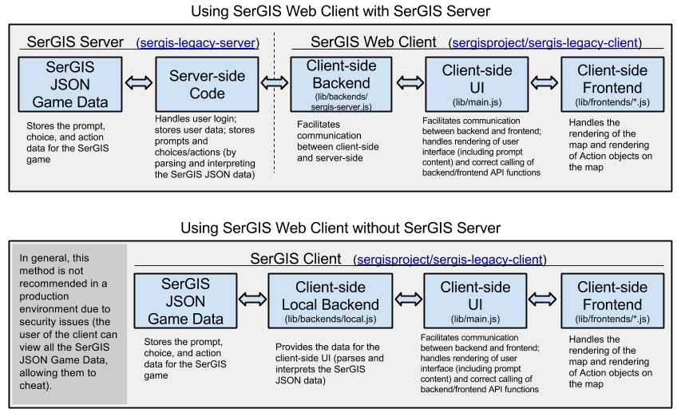

# SerGIS JSON Format Documentation

SerGIS has a special JSON format that is used to store its data. This JSON content is not usually directly available on the client-side, but rather it is used on the server-side so the server can push the data to the client as needed (or directly used by the backend if no server-side system is used).

## SerGIS JSON Object Reference

These objects are referenced below in the JSON spec.

### Action Object

A SerGIS JSON Action Object is an object representing either a "Map Action" (an action to do on the map) or a "Gameplay Action" (an action that affects the gameplay).

| Property | Type   | Value
| -------- | -----  | -----
| `name`   | string | The name of the action to perform.
| `data`   | array  | Any data to pass as parameters to the action function. If the action function does not take any parameters, you can leave this out.

**Map Actions:** The `name`s of these actions are:

 - `buffer`
 - ...
 - ...
 - ...

**Gameplay Actions:** These actions do not affect the map, but rather affect the game sequence. The `name`s of these actions are:

 - `explain`: Show an explanation for why the choice that the user chose was correct or incorrect (`data` should be an array of [Content objects][contentobject] holding the explanation to display; in most cases, it will be an array of only one [Content object][contentobject]). If this is provided before any Map Actions, it will be shown to the user before those Map Actions are rendered.
 - `goto`: Go to a specific prompt (`data` should have 1 item: the prompt index to go to). **Cannot be combined with Map Actions!**
 - `continue`: Move on to the next prompt without performing an action (`data` not required). **Cannot be combined with Map Actions!**
 - `logout`: Log the user out (`data` not required). **Cannot be combined with Map Actions!**

### Content Object

A SerGIS JSON Content Object is an object representing some sort of content that is part of a prompt or choice.

It must have a `type` property that identifies what type of content it is. The value of the `type` property determines which other properties are present.

The main value for the type is stored in `value` (which is required). Some types have other possible properties too, all of which are optional (their default values are shown).

 - **Text Type:** `{"type": "text", "value": "plain text here", "centered": false}`
 - **HTML Type:** `{"type": "html", "value": "
HTML content here
"}`
 - **Image Type:** `{"type": "image", "value": "URL of image"}`
 - **YouTube Type:** `{"type": "youtube", "value": "youtube-video-id-here", "width": 400, "height": 300, "playerVars": {"autohide": 1}}`

### Prompt Object

A SerGIS JSON Prompt Object is an object representing either a question for the user or information to show the user.

| Property  | Type   | Value
| --------  | ----   | -----
| `title`   | string | A text-only title for the prompt (usually just the general topic of the question or information).
| `map`     | object | An object with 3 properties: `latitude` (number), `longitude` (number), `zoom` (number). If any are not provided, or if `map` is not provided, then the previous values are used. **MUST be provided for the first prompt**, and **should be provided for all prompts if jumping is allowed** (see [Backends](#backends) below).
| `contents` | array&lt;[Content][contentobject]&gt; | The content of the prompt. Each array item must be a Content object.
| `choices` (optional) | array&lt;[Content][contentobject]&gt; | A list of the possible choices for the prompt. Each item must be a Content object that represents the choice. (NOTE: Unlike in the `contents` property, only one Content object can be provided for each choice.) If not provided, or if empty, a "Continue" button is shown if it is not the last prompt. (This may be useful if the prompt just provides information instead of asking a question.)
| `randomizeChoices` (optional) | boolean | Whether to randomize the choices for this prompt.

## SerGIS JSON Game Data

SerGIS JSON Game Data is a JSON file with a specific structure. The JSON data consists of an object with the following properties:

| Property | Type | Value
| -------- | ---- | -----
| `jumpingBackAllowed` (optional) | boolean | Whether the user is allowed to go back to previously answered prompts. (Provided to the client through the `logIn` and `getUser` functions of the [client backend][backends].) Default: `false`
| `onJumpBack` (optional) | string | Says what should happen regarding prompts (after the one to which the user is jumping back) for which the user already made a choice. One of the following: <ul><li>`"reset"` - disregard all the choices that the user has made on prompts after the one he or she is jumping back to</li><li>`"hide"` - remember the user's choices, but don't show any Map Actions on the map</li><li>Anything else (e.g., an empty string, or just not providing `onJumpBack`) - remember the user's choices and show the corresponding Map Actions on the map</li></ul>
| `jumpingForwardAllowed` (optional) | boolean | Whether the user is allowed to skip prompts and come back to them later. If this is `true` but `jumpingBackAllowed` is not, then the user will not be able to go back to questions that he or she skips. (Provided to the client through the `logIn` and `getUser` functions of the [client backend][backends].) Default: `false`
| `showActionsInUserOrder` (optional) | boolean | Whether to render the Map Actions in the order that the user went through the prompts (applies if `jumpingForwardAllowed` and/or `jumpingBackAllowed` are true). If this is false, the actions are rendered in the order of the prompts that they come from, regardless of the order in which the user chose them. Should be utilized by the handler for the `getPreviousMapActions` function of the [client backend][backends]. Default: `false`
| `promptList` | array | An array of objects representing the different prompts and choices.

- Each object in the `promptList` array has the following properties:

  | Property | Type | Value
  | -------- | ---- | -----
  | `prompt` | [Prompt][promptobject] | The SerGIS Prompt object representing the prompt.
  | `actionList` (optional) | array | An array of objects representing different actions. Each item in this array corresponds to a choice in the `prompt.choices` array. If `prompt.choices` is empty or not provided, then this can be empty or not provided. (This is separate from `prompt` so a server can send `prompt` on to the client without revealing which choice is best.)
  
  

  - Each object in the `actionList` array has the following properties:

    | Property | Type | Value
    | -------- | ---- | -----
    | `actions` | array<[Action][actionobject]> | An array of SerGIS Action objects representing the actions to be taken if this choice is selected. (Actions are evaluated in the order that they appear in this array.) After these actions are taken, the game will advance to the next prompt automatically (unless otherwise instructed).
    | `pointValue` (optional) | number | The amount of points that the user should have added to his score for choosing this choice. If not provided, defaults to `0`.

### Example

An example can be seen in the [sergis-client repository](https://github.com/sergisproject/sergis-client), in [the testdata.js file](https://github.com/sergisproject/sergis-client/blob/master/testdata.js).

[actionobject]: json.html#action-object "SerGIS JSON Action Object"
[contentobject]: json.html#content-object "SerGIS JSON Content Object"
[promptobject]: json.html#prompt-object "SerGIS JSON Prompt Object"
[sergis-json-game-data]: json.html#sergis-json-game-data "SerGIS JSON Game Data"
[backends]: client.html#backends "SerGIS Client Backends"
