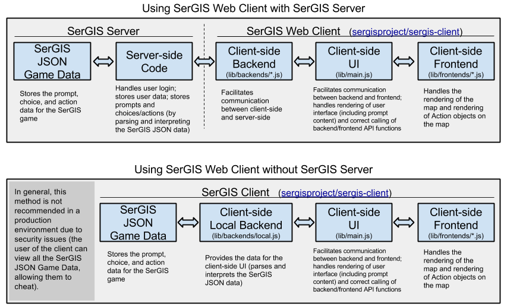

# Documentation

Here is an overview of the relationship between the parts of the SerGIS Legacy Web Client and its interaction with the SerGIS Legacy Server and SerGIS Legacy JSON Game Data:

 - [SerGIS Legacy JSON Game Data Format Documentation](json.html)
 - [SerGIS Legacy Web Client Documentation](client.html)
